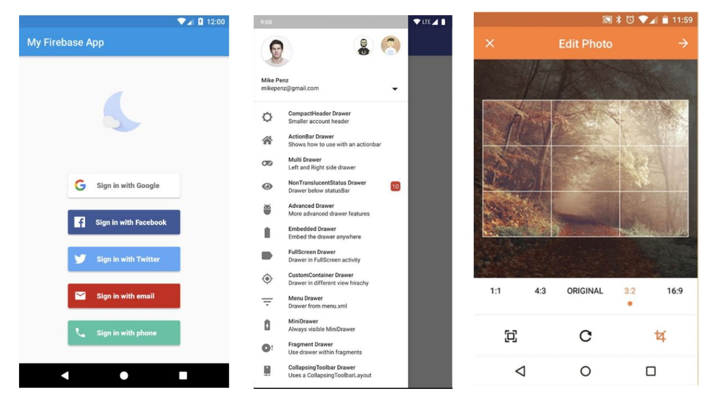
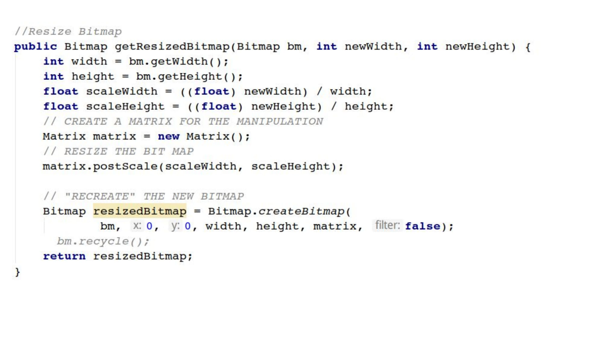
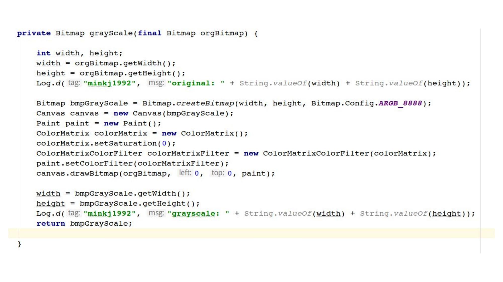
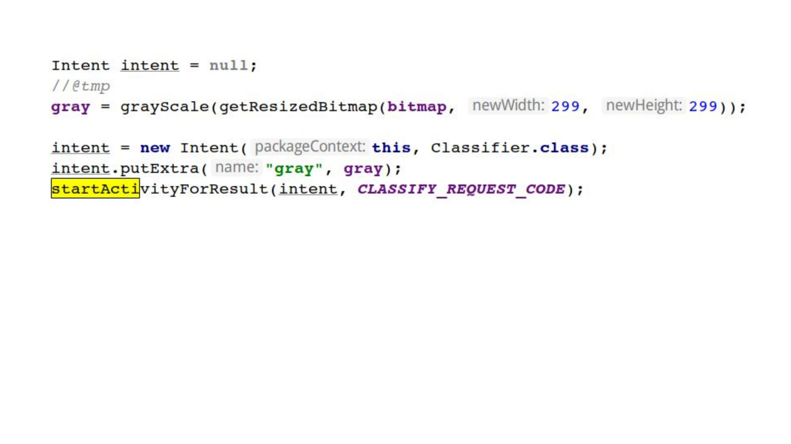
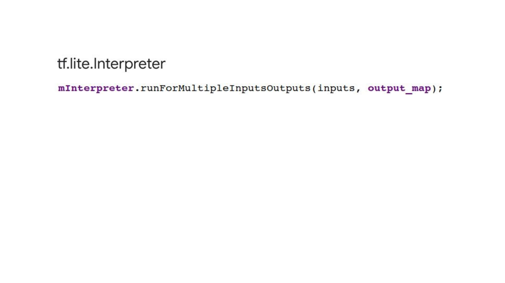
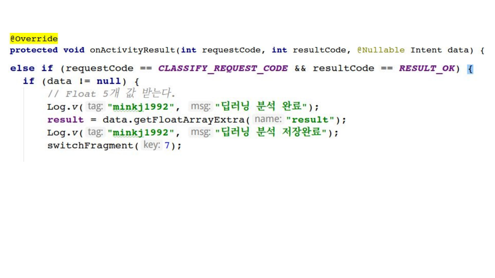
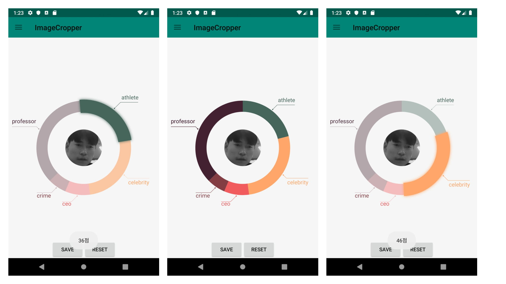
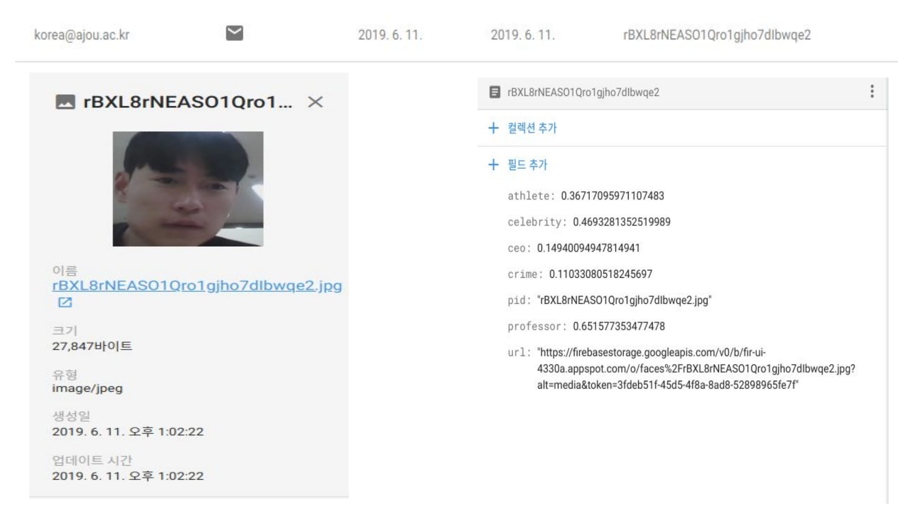

# `관상 분석 app`
- `Physiognomy Analyzer App`

- `프로젝트 주제`: 얼굴 이미지를 5가지값으로 관상분석 딥러닝하여 `근력`,`지력`,`재력`,`카리스마`,`범죄력`을 보여주고, 다른 사람들의 분석결과를 공유할 수 있는 `Android App`(`JAVA`).


<p align="center"></p>
<p align="center"></p>
<p align="center"></p>
<p align="center"></p>
<p align="center"></p>
<p align="center"></p>
<p align="center"></p>
<p align="center"></p>
<p align="center"></p>
<p align="center"></p>
<p align="center"></p>


<h5 align="center" >초기 사용자의 경우</h5>
<p align="center"></p>

<br/>
<br/>
<h5 align="center" >기존 id가 있을 경우(사진 포함)</h5>
<p align="center">

</p>


## `Class Explanation`
시간되면 작성 예정..


## `Keywords`
`inception-v3`,`tflite.interpreter`,`AndroidImageCrop`,`materialDesign` ,`fragment & framelayout` ,`firestore` ,`firebaseAuth`,`firestorage`,`CircularFillableLoaders`, `splashscreen`


## `프로젝트 상세설명`

- 이외에도 `com.razerdp.widget.animatedpieview.AnimatedPieView;`를 사용하여 `도넛 차트` 생성
- `Glide`를 활용한 firestorage 이미지 `bitmap` loader
    - 이미지 loading 과정에 보여줄 `progressBar` animation
- [`CircularFillableLoaders`](https://github.com/lopspower/CircularFillableLoaders)를 활용한 `splashscreen`
    - wave form splashScreen
- `switchfragment()`를 활용하여 sidebar 클릭에 따라서 ui 및 logic이 변하도록 하였다.
- `gallery`에서 `FloatingActionButton`을 사용하여 `result`view를 띄워주도록 하기 위해서 `BroadcastManager`를 통해 `intent` 값 전달 받았다.

`/MainActivity.java`
```java
LocalBroadcastManager.getInstance(this).registerReceiver(mReceiver, new IntentFilter("galleryIntent"));
    private BroadcastReceiver mReceiver = new BroadcastReceiver() {
    @Override
    public void onReceive(Context context, Intent intent) {
        gray = grayScale(getResizedBitmap((Bitmap)intent.getParcelableExtra("BitmapImage"), 299, 299));
        gray = intent.getIntExtra("idx",1);
        result = intent.getFloatArrayExtra("result");
        switchFragment(7);
    }
};
```

- gallery에서 전달하는 intent는 flaotingActionButton을 클릭하기 전까지는 show 해주면 안되기 때문에, intent를 update 시켜줄때마다 CLEAR_TOP시켜주었다.

`/Gallery.java`
```java
        show.setOnClickListener(new View.OnClickListener() {
        @Override
        public void onClick(View view) {
            Intent intent = new Intent("galleryIntent").setFlags(Intent.FLAG_ACTIVITY_NEW_TASK | Intent.FLAG_ACTIVITY_CLEAR_TOP);
            intent.putExtra("idx",cnt);
            intent.putExtra("BitmapImage", bitmap);
            intent.putExtra("result",result);
            LocalBroadcastManager.getInstance(getContext()).sendBroadcast(intent);
            Log.v("minkj1992","gallery item send idx: "+ cnt);
        }
    });
```


--------------------------------------
# `TFlite with Android error Handling`

> 여기서부터는 프로젝트를 하면서 겪었던 error들을 모아놓은 자료입니다.
## 1st Error
> Unexpected failure when preparing tensor allocations: tensorflow/lite/kernels/conv.cc:224

`원인`: 
- `Interpreter.run()`와 `Interpreter.runForMultipleInputsOutputs()`할 때 input의 형식이 다르다. 

`해결`:
- `run()`일 경우에는 `private final float[][][][] input = new float[BATCH_SIZE][IMG_HEIGHT][IMG_WIDTH][NUM_CHANNEL];`형식을 그대로 사용해도 된다.

- `runForMultipleInputsOutputs()`일경우에는 `Object[] inputs = new Object[]{input};`를 해주어 input란에 넣어주어야 한다.

## 2nd Error
> float[][] cannot be cast to float[]

`원인`: 
- `out[i] = ((float[])output_map.get(i))[0];`

`해결`:
- `out[i] = ((float[][])output_map.get(i))[0][0];`

## 3rd Error

> java.lang.NullPointerException: Attempt to write to null array

`원인`:
- 배열을 생성할 때, 초기화를 하지 않아 생기는 에러

`해결`:
- `float[] out = null` -> `float[] out = new float[5];`

---------------------------------------------

# `firestore with fireAuth error`

## 1st error
> 2019-06-04 14:11:31.674 6556-6556/spartons.com.imagecropper E/AuthUI: A sign-in error occurred.
    com.firebase.ui.auth.FirebaseUiException: Error when saving credential.
        at com.firebase.ui.auth.viewmodel.smartlock.SmartLockHandler$1.onComplete(SmartLockHandler.java:98)
        at com.google.android.gms.tasks.zzj.run(Unknown Source:4)
        at android.os.Handler.handleCallback(Handler.java:873)
        at android.os.Handler.dispatchMessage(Handler.java:99)
        at android.os.Looper.loop(Looper.java:193)
        at android.app.ActivityThread.main(ActivityThread.java:6669)
        at java.lang.reflect.Method.invoke(Native Method)
        at com.android.internal.os.RuntimeInit$MethodAndArgsCaller.run(RuntimeInit.java:493)
        at com.android.internal.os.ZygoteInit.main(ZygoteInit.java:858)
     Caused by: com.google.android.gms.common.api.ApiException: 16: No eligible accounts can be found.
        at com.google.android.gms.common.internal.ApiExceptionUtil.fromStatus(Unknown Source:4)
        at com.google.android.gms.common.internal.zai.zaf(Unknown Source:2)
        at com.google.android.gms.common.internal.zaj.onComplete(Unknown Source:6)
        at com.google.android.gms.common.api.internal.BasePendingResult.zaa(Unknown Source:172)
        at com.google.android.gms.common.api.internal.BasePendingResult.setResult(Unknown Source:131)
        at

- `원인`: 
    > By default, FirebaseUI uses Smart Lock for Passwords to store the user's credentials and automatically sign users into your app on subsequent attempts.
- `해결방법`:
    - 
    ```java
    startActivityForResult(
    AuthUI.getInstance()
        .createSignInIntentBuilder()
        .setIsSmartLockEnabled(false)
        .build(),
    RC_SIGN_IN);
    ```
## 2nd error

> AGPBI: {"kind":"error","text":"Cannot fit requested classes in a single dex file (# methods: 97073 \u003e 65536)","sources":[{}],"tool":"D8"}
FAILURE: Build failed with an exception.

> * What went wrong:
Execution failed for task ':app:transformDexArchiveWithExternalLibsDexMergerForDebug'.
 com.android.builder.dexing.DexArchiveMergerException: Error while merging dex archives: 
  The number of method references in a .dex file cannot exceed 64K.
  Learn how to resolve this issue at https://developer.android.com/tools/building/multidex.html

- [참고자료](https://blog.miyam.net/33)

- `원인`:
    - 메소드 갯수가 64k이상을 넘어갈때 일어나는 현상

- `해결책`:
1. `build.gradle` 수정

    - 기본적으로 sdk 컴파일 관련 버전은 21 이상으로 변경 (기존에 되어 있다면 패스)

    - defaultConfig 아래에 multiDexEnabled true 추가

    - dependencies 아래에 compile 'com.android.support:multidex:1.0.0' 추가

    - dexOptions 아래에 jumboMode true 와 javaMaxHeapSize "4g" 추가 (이 부분을 넣지 않으면 메모리가 부족하다고 에러 메세지 발생)

2. `AndroidManifest.xml` 파일 수정

      - application 태그 속성으로 android:name="android.support.multidex.MultiDexApplication" 추가


## 3rd error
> /home/minkj1992/AndroidStudioProjects/android_facial_analysis/cropMaterial/androidCropKeras/app/src/main/java/spartons/com/imagecropper/MainActivity.java:
uses or overrides a deprecated API.
Recompile with -Xlint:deprecation for details.

## 4th error
>  Can't compress a recycled bitmap in the compress call!

- `해결책`: .recycle()을 삭제함

## 5th error 
> 2019-06-08 21:57:11.345 10414-10501/spartons.com.imagecropper E/StorageException: StorageException has occurred.
    An unknown error occurred, please check the HTTP result code and inner exception for server response.
     Code: -13000 HttpResult: 0
2019-06-08 21:57:11.359 10414-10501/spartons.com.imagecropper E/AndroidRuntime: FATAL EXCEPTION: FirebaseStorage-Upload-1
    Process: spartons.com.imagecropper, PID: 10414
    java.lang.NoSuchMethodError: No virtual method getToken(Z)Lcom/google/android/gms/tasks/Task; in class Lcom/google/firebase/FirebaseApp; or its super classes (declaration of 'com.google.firebase.FirebaseApp' appears in /data/app/spartons.com.imagecropper-t0U3Kor0dx9At1TYdvOVOA==/base.apk!classes2.dex)
        at com.google.firebase.storage.internal.Util.getCurrentAuthToken(com.google.firebase:firebase-storage@@16.1.0:148)
        at com.google.firebase.storage.internal.ExponentialBackoffSender.sendWithExponentialBackoff(com.google.firebase:firebase-storage@@16.1.0:65)
        at com.google.firebase.storage.internal.ExponentialBackoffSender.sendWithExponentialBackoff(com.google.firebase:firebase-storage@@16.1.0:57)
        at com.google.firebase.storage.UploadTask.sendWithRetry(com.google.firebase:firebase-storage@@16.1.0:457)
        at com.google.firebase.storage.UploadTask.beginResumableUpload(com.google.firebase:firebase-storage@@16.1.0:257)
        at com.google.firebase.storage.UploadTask.run(com.google.firebase:firebase-storage@@16.1.0:198)
        at com.google.firebase.storage.StorageTask.lambda$getRunnable$7(com.google.firebase:firebase-storage@@16.1.0:1106)
        at com.google.firebase.storage.StorageTask$$Lambda$12.run(Unknown Source:2)
        at java.util.concurrent.ThreadPoolExecutor.runWorker(ThreadPoolExecutor.java:1167)
        at java.util.concurrent.ThreadPoolExecutor$Worker.run(ThreadPoolExecutor.java:641)
        at java.lang.Thread.run(Thread.java:764)
2019-06-08 21:57:11.350 10414-10501/spartons.com.imagecropper E/StorageException: StorageException has occurred.
    An unknown error occurred, please check the HTTP result code and inner exception for server response.
     Code: -13000 HttpResult: 0


> storageException Error (왠지 unverified token 에러 인듯)
- `원인`: "make sure you use the same version for all the firebase dependencies for those that you use. "
- `해결책`: (firebase version dependency를 다 맞추어주자)

[참고자료](https://github.com/firebase/FirebaseUI-Android/releases)
[참고자료 for firebase-ui(파일 다운로드)](https://github.com/firebase/FirebaseUI-Android/releases)


## 6th error 
> 2019-06-08 22:07:31.326 10848-10848/spartons.com.imagecropper E/AndroidRuntime: FATAL EXCEPTION: main
    Process: spartons.com.imagecropper, PID: 10848
    java.lang.NullPointerException: Attempt to invoke virtual method 'java.lang.Class java.lang.Object.getClass()' on a null object reference
        at android.support.v4.app.BackStackRecord.doAddOp(BackStackRecord.java:392)
        at android.support.v4.app.BackStackRecord.replace(BackStackRecord.java:439)
        at android.support.v4.app.BackStackRecord.replace(BackStackRecord.java:430)
        at spartons.com.imagecropper.MainActivity.switchFragment(MainActivity.java:667)
        at spartons.com.imagecropper.MainActivity.onNavDrawerItemSelected(MainActivity.java:510)
        at spartons.com.imagecropper.MainActivity.signOutUser(MainActivity.java:608)
        at spartons.com.imagecropper.MainActivity.onNavDrawerItemSelected(MainActivity.java:525)
        at spartons.com.imagecropper.MainActivity.access$400(MainActivity.java:65)
        at spartons.com.imagecropper.MainActivity$6.onItemClick(MainActivity.java:466)
        at com.mikepenz.materialdrawer.DrawerBuilder$6.onClick(DrawerBuilder.java:1786)
        at com.mikepenz.materialdrawer.DrawerBuilder$6.onClick(DrawerBuilder.java:1760)
        at com.mikepenz.fastadapter.FastAdapter$1.onClick(FastAdapter.java:608)
        at com.mikepenz.fastadapter.utils.EventHookUtil$1.onClick(EventHookUtil.java:72)
        at android.view.View.performClick(View.java:6597)
        at android.view.View.performClickInternal(View.java:6574)
        at android.view.View.access$3100(View.java:778)
        at android.view.View$PerformClick.run(View.java:25885)
        at android.os.Handler.handleCallback(Handler.java:873)
        at android.os.Handler.dispatchMessage(Handler.java:99)
        at android.os.Looper.loop(Looper.java:193)
        at android.app.ActivityThread.main(ActivityThread.java:6669)
        at java.lang.reflect.Method.invoke(Native Method)
        at com.android.internal.os.RuntimeInit$MethodAndArgsCaller.run(RuntimeInit.java:493)
        at com.android.internal.os.ZygoteInit.main(ZygoteInit.java:858)

- `원인`:  `logOut error`

- `fragmentTransaction.replace(fragment_container.getId(), fr);` 이게 fr = null이 초기값이여서 이런 에러가 뜨는 것이다.


## 7th error
> java.lang.IllegalArgumentException: Invalid data. Unsupported type: android.net.Uri$StringUri (found in field url)
- url 실패하는 현상
- `원인`
    - async하게 작동하여 download url을 가져오더라도, 계속해서 null값이 저장되었던 것이다.이럴때는 onComplete()가 호출되었을 때, 트랜잭션처럼 모든 것이 다 되었을 때 저장되도록 완성한다.
    - 어라? 왜 계속 실패할까? 아! alterUserDB에서 toString()안해줘서 그렇구나


## 8th error
> 신규회원이 아닌데, 신규회원이라고 toast되는 현상
- `원인` : async하게 데이터가 전달이되어 순서가 꼬였던 현상


## 9th error
> java.lang.IllegalArgumentException: Invalid data. Unsupported type: android.net.Uri$StringUri (found in field url)

- `원인` : url을 저장할때는 .toString()를 사용하여 string화 시켜서 저장해야한다.


## 10th error [glide 에러]
> Process: spartons.com.imagecropper, 
PID: 13511 java.lang.NullPointerException: uriString

- `원인` : firebase 데이터 url 필드에 값이 null이여서 glide 에러가 떴었다


## 11th error 
> cannot convert to Double to float

- `원인`: 
    - `Java.lang.Double` -> `float`이 직접적으로 되지가 않았다. 
    - `(float)firebase DocumentSnapshot.get()` 하였지만
    - 계속 에러가 떠서, `Float.valueOf(String.valueOf(document.getDouble("athlete")));` 결국 이렇게 작성해 보았다.

## 12th error
>  glide animation이 작동안한다.

## splash screen 
> https://github.com/lopspower/CircularFillableLoaders 이거 사용중인데 작동이 안되네.


